# How to install RHEL 9.3 aarch64 on Raspberry Pi4b Using UEFI Firmware


### Checklist:

- [ ] ```rhel-baseos-9.0-aarch64-dvd.iso``` avaliable [here](https://developers.redhat.com/products/rhel/download)
- [ ] ```RPi4_UEFI_Firmware_v1.29.zip``` avaliable [here](https://github.com/pftf/RPi4/releases)
- [ ] host system with balena etcher or gparted 
- [ ] Raspberry Pi 4 model b
- [ ] Micro-HDMI to HDMI adapter
- [ ] USB keyboard and mouse
- [ ] Micro SD Card (16gb reccomended)
- [ ] USB Drive (16gb reccomended)

### The DVD .iso file from Red Hat:

Start by downloading the redhat aarch64 DVD .iso from [here](https://developers.redhat.com/products/rhel/download). It is free with a student email. I downloaded the ```rhel-baseos-9.0-aarch64-dvd.iso``` file. A the time of this writing, I was getting a ```synchronous error``` using the latest version of redhat, which is why we use an older version. I think this is a bug with the installer. This is not a big issue though, because once inside the os, we can update the kernel using ```dnf```.  


### About the UEFI Firmware:

Red hat for arm requires a uefi. At the time of this writing, I was unable to get the latest version to work properly, and instead had to resort to version ```1.29```. You must go to the [releases](https://github.com/pftf/RPi4/releases) section, as the files you need to copy are not stored directly in the repo. The tree for ```RPi4_UEFI_Firmware_v1.29.zip``` looks something like this:

```console
.
├── RPI_EFI.fd
├── Readme.md
├── bcm2711-rpi-4-b.dtb
├── bcm2711-rpi-400.dtb
├── bcm2711-rpi-cm4.dtb
├── config.txt
├── firmware
│   ├── LICENCE.txt
│   ├── Readme.txt
│   └── brcm
│       ├── brcmfmac43455-sdio.Raspberry
│       ├── brcmfmac43455-sdio.bin
│       ├── brcmfmac43455-sdio.clm_blob
│       └── brcmfmac43455-sdio.txt
├── fixup4.dat
├── overlays
│   └── miniuart-bt.dtbo
└── start4.elf

```

### More Prerequisites:

Red Hat reccomends using the ``dd`` method to flash usb drives with an iso; however, Balena etcher should work as well (even though it may throw a ```missing partition table error``` during the write stage). To prepare the SD card, we used gparted. First, start by installing gparted:

```console
sudo dnf install -y gparted
```

Then, launch gparted:

```console
gparted
```


### Preparing the boot drives:

We need two drives to install the operating system. The first drive is an sd card (reccomended 16gb or larger). This sd card will contain the UEFI and the final operating system. The second drive we need is a USB for the .iso from redhat (also 16gb or larger reccomended). We will install it in a similar way you would on an x86 system (even though we are using aarch64).

## Preparing the SD Card and instaling the UEFI:


We need to make sure both drives are using the msdos partition table (which is MBR). For the micro sd card, we want to allocate around 128mb in fat16 for the boot partition, then allocate a 1000M in ext4 and the rest as ext4. Finally, we want to copy all the firmware files over. In gparted, start by deleting all data on the SD card so it looks like this:

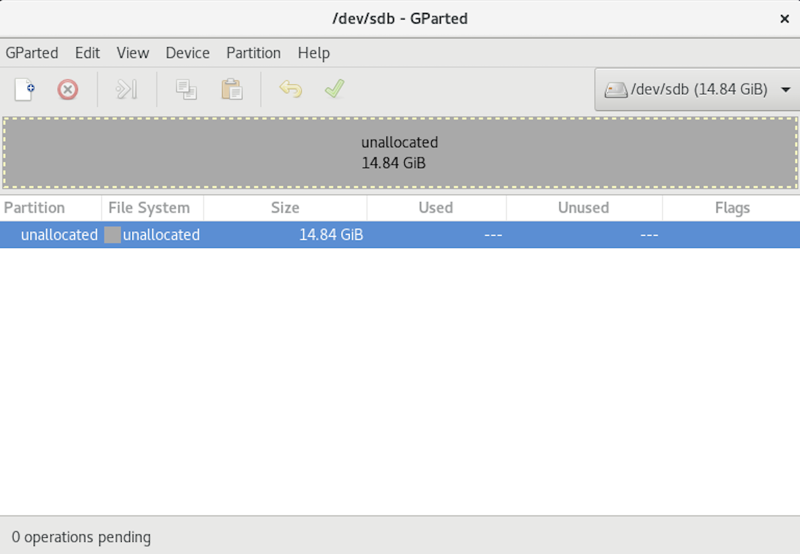


Then, select device:

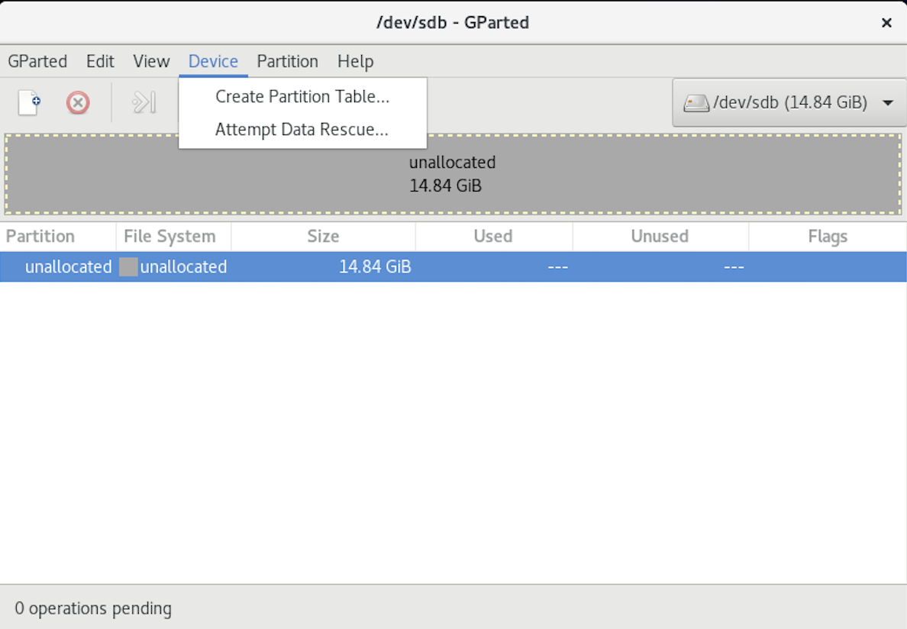

Create a partition table:

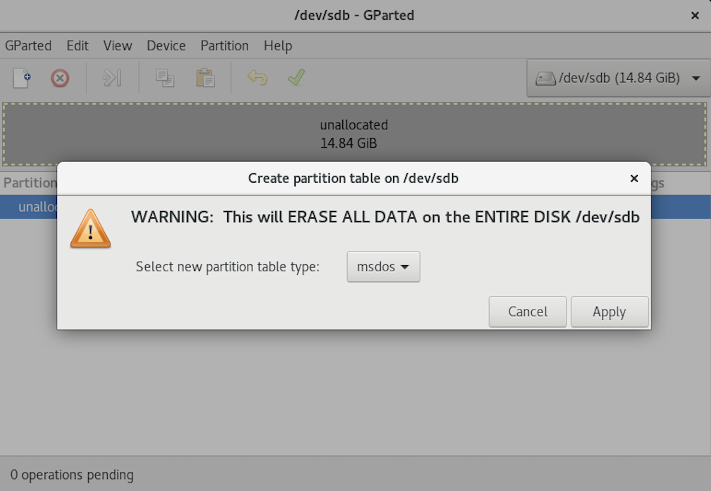

Select msdos and click apply. Now, select the drive and create a new partition

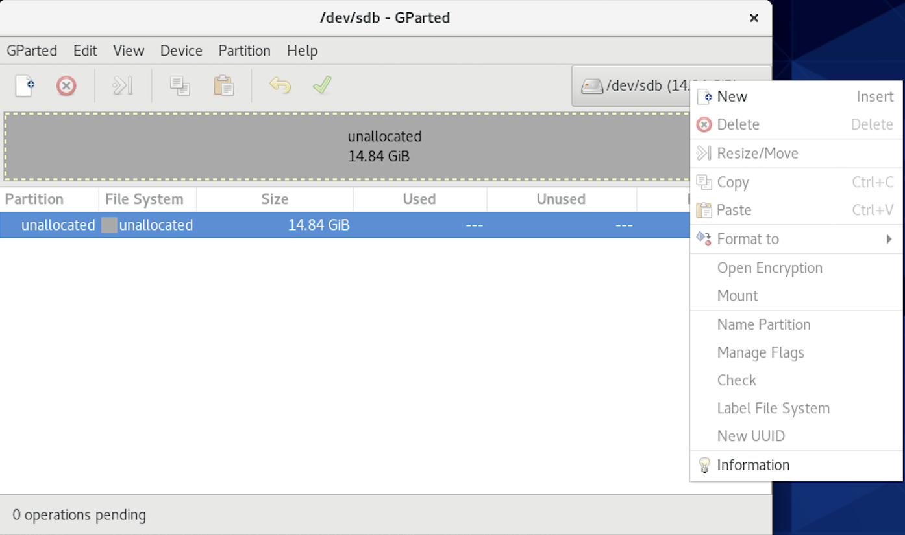

In the partition window, set this size to 100M and use fat16 for the file system.

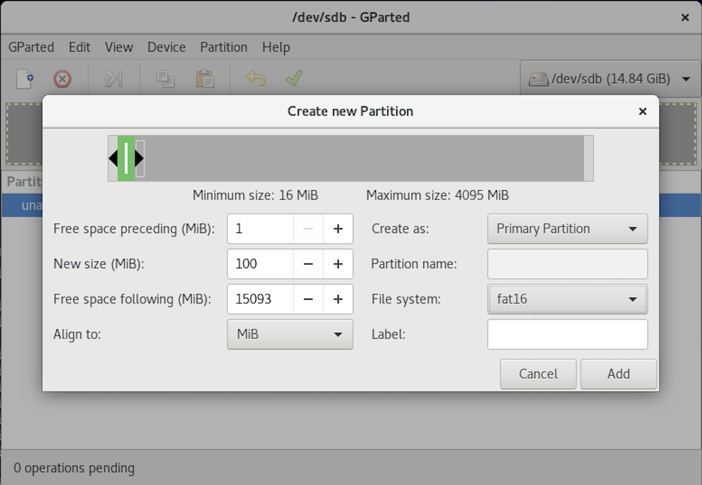

Repeat this process, now with 1000M as EXT4:

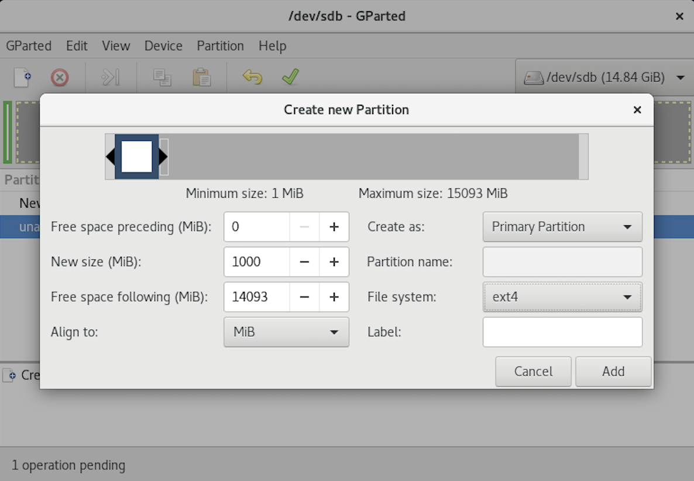

And the remaining as EXT4:

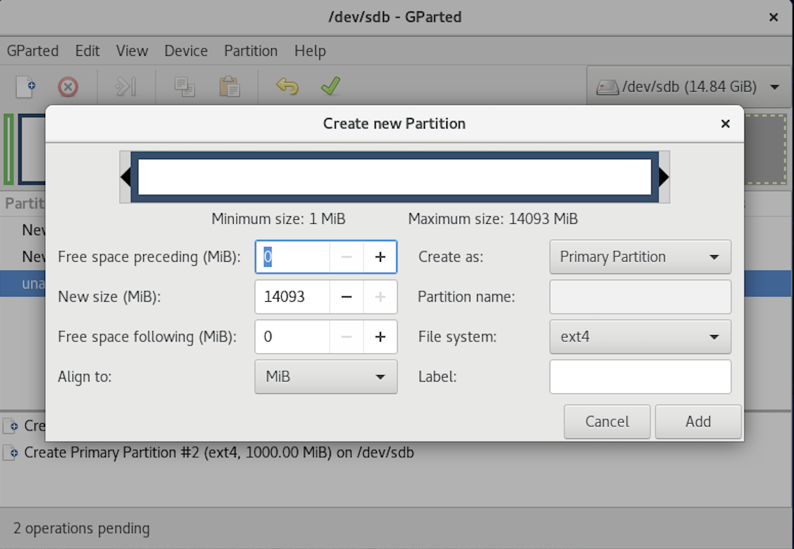

Check that the file system looks something like this using ```sudo fdisk -l```

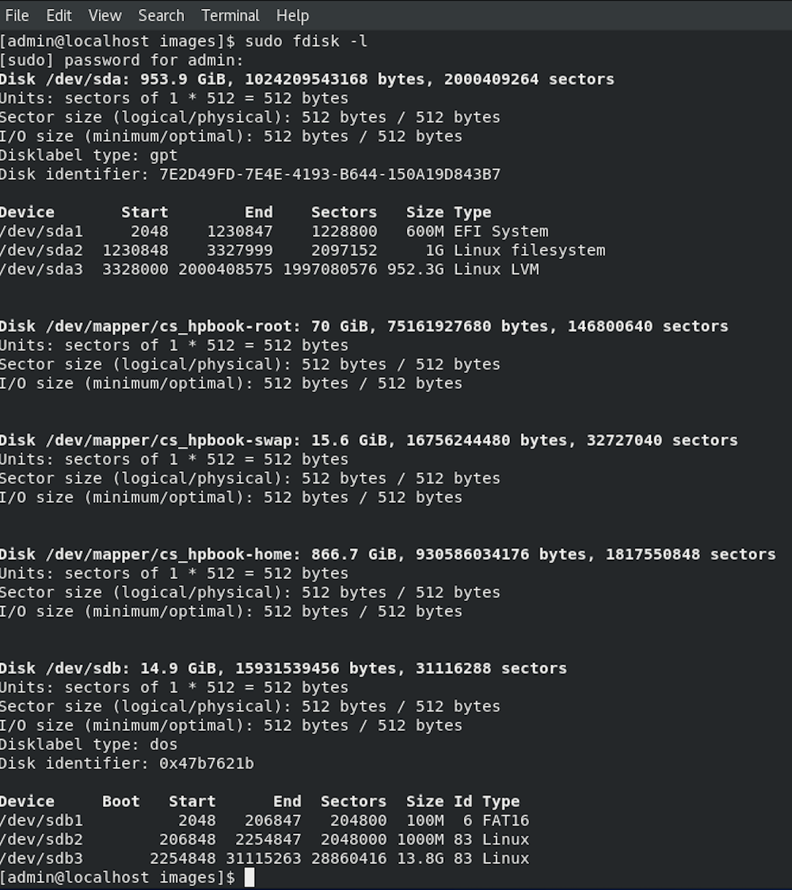

Now, after downloading the firmware, extract the .zip and open the folder.

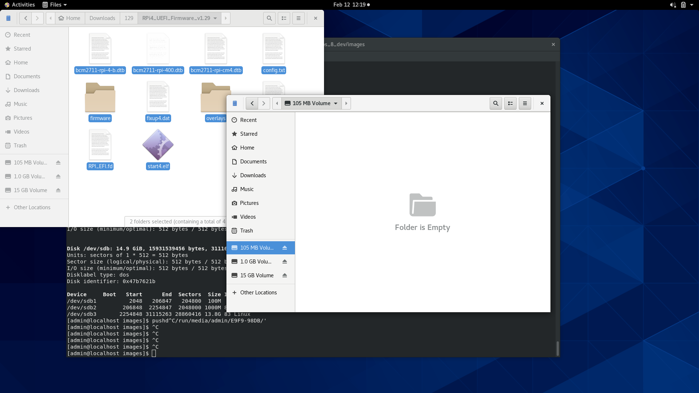

Copy the files to the 100M fat16 partition we made:


Eject the drive and plug it into the pi4. If everything was done correctly, you should be able to boot into UEFI:

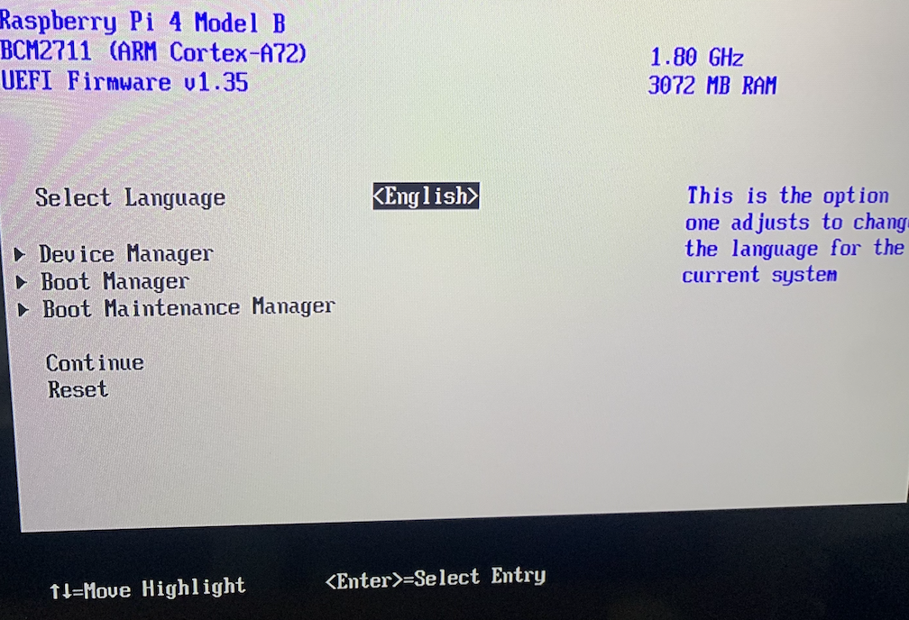


## USB installer

For the usb drive that we copy the iso installer to, format the whole thing to fat32. It should look like this:

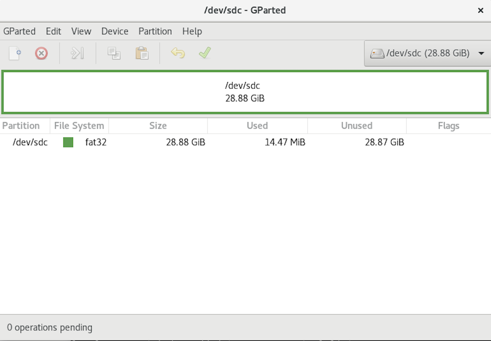

Make a note of the address of the usb drive. In this case, it is ```/dev/sdc```. Now, in the downloads folder (or whichever directory has the .iso file), run:

```console
sudo dd if=rhel-baseos-9.0-aarch64-dvd.iso of=/dev/sdc bs=512k
```
If you are not using linux, you can also use balena for this step. Once the command finishes successfully, plug it into the pi and boot from it. 


## Installation

Once the pi boots into the UEFI, there will be an option to test the media, run the media without testing, or troubleshoot. Add the ```nomodeset=on``` parameter to the kernel on boot, to ensure we don't get any video driver issues. Then launch the USB installer. Configure as you see fit, however, under the installation destination, we need to partition manually. We should see four partitions below. Note, here, I used a 64gb micro SD card and a 32gb usb drive. 


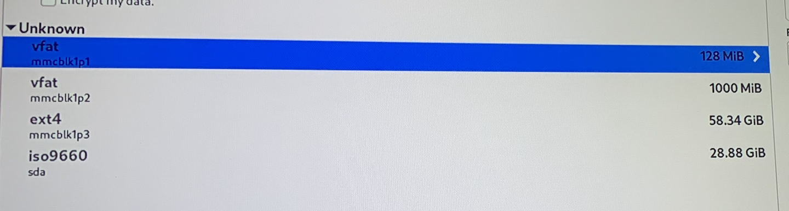


Make sure the 100M fat16 partition points to ```/boot/efi``` and select the ```EFI System Partition```. Check reformat.

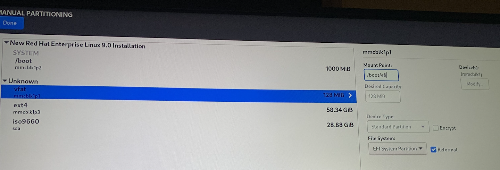

Make sure the 1000M ext4 partition points to ```/boot``` and select the ```ext4 ```. Check reformat.

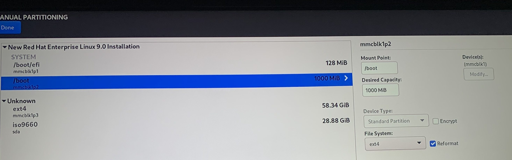

Make sure the remaining ext4 partition points to ```/``` and select the ```ext4 ```. Check reformat.

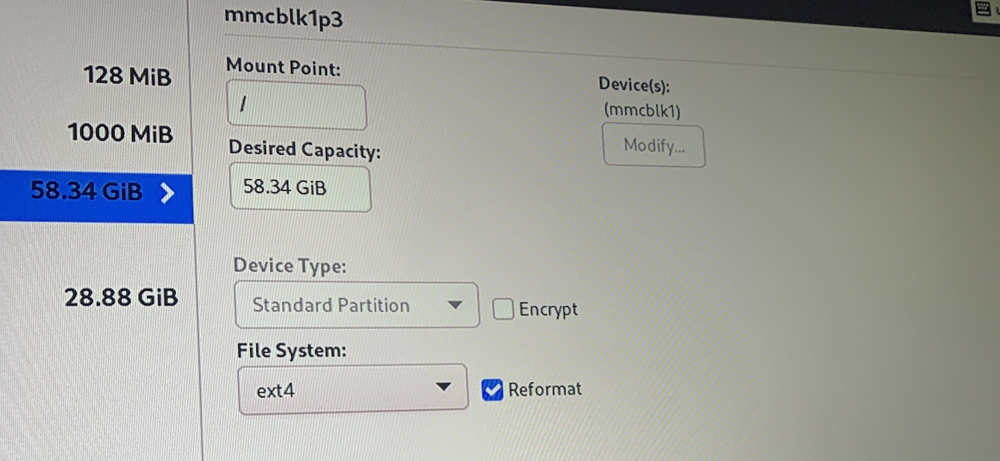

We will get a swap warning. This is ok.

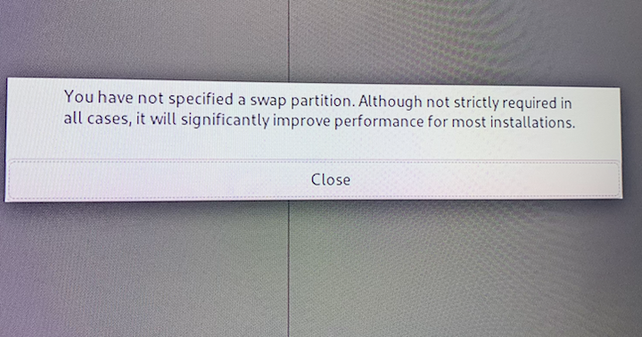


Run the installer and let the system reboot.

## Fixing Some Issues with the Installer:

The installer changes some files in the 100M fat16 partition, and the easiest way to repair them is to re mount the drive in linux--and copy the firmware back over. We can do this with the ```sudo mount``` command. 

```console
mkdir temp
sudo mount /dev/sdb1 temp
pushd temp
sudo cp -r ~/Downloads/RPI4_UEFI_Firmware_v1.29/* .
popd
sudo umount temp/
```
Now, put the sd card back in the pi4, and remove the USB iso installer. Turn on the pi.

## Pointing to the correct file in the UEFI:

After the reboot, enter the UEFI Shell, and type the following:

```console
FS0:
```

Then, type the following:

```console
bcfg boot add 0 FS0:\EFI\redhat\shimaa64.efi "Target = 000x, bcfg Add Boot000x as 0"
```

...and finally, 

```console
reset
```

**Note:** If you get an error, we can also test the install by telling the efi to boot directly from this file: ```EFI/redhat/shimaa64.efi```

Make sure an ethernet cable is plugged into the system. If everything is configured properly, the UEFI should first boot into grub, then boot the kernel. The system may hang on a ```_``` for a long time after the boot menu. This is okay! Just wait a few minutes. Once inside of the new operating system, we want to update to the latest kernel. To do this, run:

```console
sudo dnf update -y
```

This will take a really long time. Be patient. 

## Modify kernel:

We want to resize the base address register for hardware compatibility. Edit the following file:

```console
sudo emacs /etc/default/grub
```

And add the following line:

```console
pci=realloc=on
```

Update grub:

```console
sudo grub2-mkconfig -o /boot/efi/EFI/redhat/grub.cfg
```

And reboot the system:

```console
systemctl poweroff
```

## Results:

If all goes well, you should be able to log into red hat:


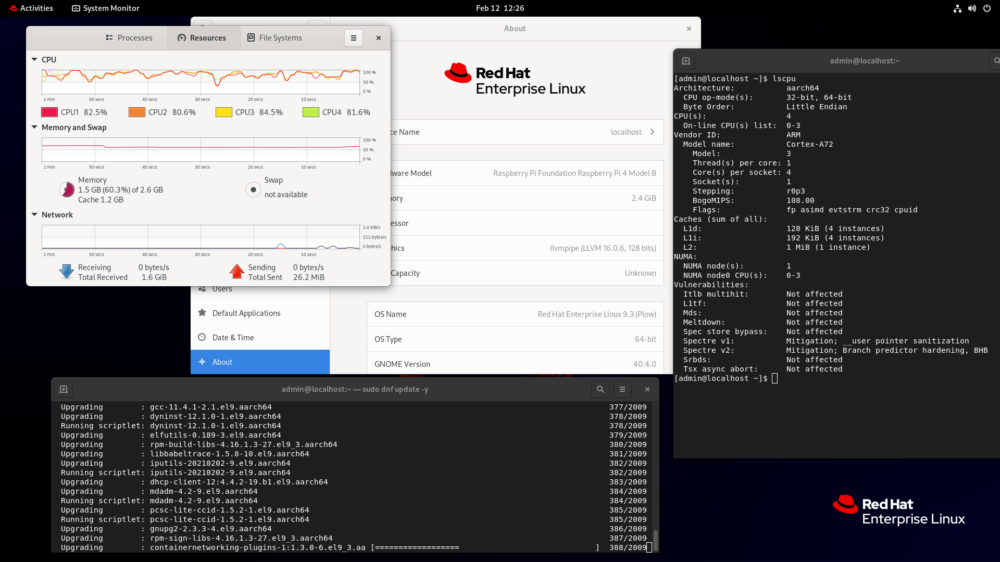

